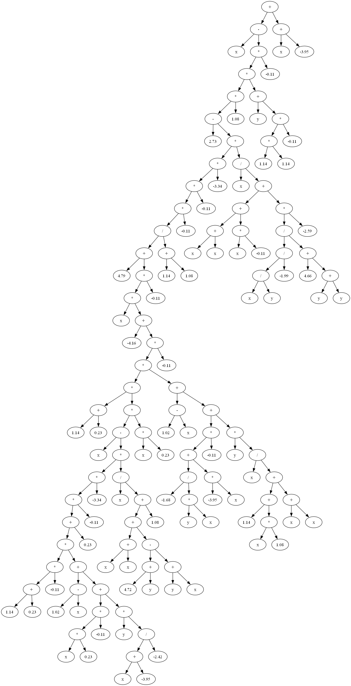

# Evolutionary Computation
## Assignment Item 3, Term 1, 2025
## Symbolic Regression using Genetic Programming

**Student Number:** 12223508
**Student Name:** Furkan Tekkartal

**Unit Coordinator:** Umair Ullah Tariq
**Class:** Tutorial 1
**Date:** 12 June 2025

**2025 Term 1**

---

# Table of Contents

1.  [Introduction](#1-introduction)
2.  [Execution Instructions](#2-execution-instructions)
3.  [Problem Formulation](#3-problem-formulation)
    *   3.1. Symbolic Regression Problem
    *   3.2. Dataset and Objective
4.  [Algorithm Implementation](#4-algorithm-implementation)
    *   4.1. Genetic Programming (GP)
    *   4.2. Baseline Algorithms for Comparison
    *   4.3. Implementation Details
5.  [Experimental Evaluation](#5-experimental-evaluation)
    *   5.1. Experimental Setup
    *   5.2. Performance Metrics
6.  [Results and Analysis](#6-results-and-analysis)
    *   6.1. GP Optimization Performance
    *   6.2. Analysis of the Evolved Solution
    *   6.3. Comparison with Other Evolutionary Algorithms
7.  [Discussion](#7-discussion)
    *   7.1. Strengths and Limitations of the GP Approach
    *   7.2. Interpretation of Results
8.  [Conclusion](#8-conclusion)
9.  [References](#9-references)

---

# 1. Introduction

Finding an accurate mathematical model to describe a dataset is a fundamental challenge in science and engineering. While traditional regression methods are effective when the model structure is known, many real-world problems involve discovering the underlying function itself. This task, known as symbolic regression, is inherently difficult due to the near-infinite search space of possible mathematical expressions.

Evolutionary Algorithms (EAs) provide powerful, stochastic methods for navigating such complex search spaces. Genetic Programming (GP), in particular, is a paradigm within EAs specifically designed to evolve computer programs and expressions. It offers a robust framework for solving symbolic regression problems without prior assumptions about the model's form.

**Objectives:**
1.  Implement a Genetic Programming system from scratch to solve a symbolic regression problem.
2.  Apply the GP algorithm to discover a function `f(x, y)` that accurately models a given dataset.
3.  Compare the principles of GP with other major evolutionary paradigms, namely Particle Swarm Optimization (PSO) and Evolution Strategies (ES).
4.  Analyze the performance, strengths, and limitations of the implemented GP solution.

This study demonstrates the power of GP as a tool for automated model discovery and provides a detailed analysis of its performance on a specific, challenging dataset.

---

# 2. Execution Instructions

The project was implemented in Python, leveraging standard libraries for core logic and `graphviz` for visualization. The code is structured in a single script for ease of execution.

## Prerequisites:
```bash
pip install graphviz
```
Additionally, the Graphviz system software must be installed and its `bin` directory added to the system's PATH. It can be downloaded from [https://graphviz.org/download/](https://graphviz.org/download/).

## File Structure:
-   **`symbolic_regression_gp.py`**: The main Python script containing the complete GP implementation.
-   **`report.md`**: This report file.
-   **`best_solution_tree.png`**: The image of the best-evolved tree, generated upon successful execution.

## Running the Code:
The program can be executed from a terminal or command prompt.
```bash
python symbolic_regression_gp.py
```

## Output:
-   The console will display the progress of the evolution, reporting the best fitness (error) found in each generation.
-   Upon completion, a summary of the best solution, its fitness, and its prefix notation will be printed.
-   A PNG image file named `best_solution_tree.png` will be saved in the same directory.

---

# 3. Problem Formulation

## 3.1. Symbolic Regression Problem

The core task is to perform symbolic regression on a dataset with two independent variables, `x` and `y`, and one dependent variable, `Result`. The goal is to discover a mathematical function `f(x, y)` that accurately predicts `Result` given the inputs `x` and `y`. Unlike conventional regression where a model like `f(x,y) = ax + by + c` is assumed, GP must discover both the functional form (the operators like `+`, `*`, etc.) and the constants.

This problem is representative of real-world data modeling scenarios where the relationship between variables is unknown and must be derived from empirical data.

## 3.2. Dataset and Objective

The optimization is based on a fixed dataset of 49 `(x, y, Result)` data points, with `x` and `y` values ranging from -1 to +5. This dataset serves as the "fitness cases" for evaluating the performance of each evolved expression.

**The primary objective is to minimize the Sum of Absolute Errors (SAE):**

$SAE = \sum_{i=1}^{49} |f(x_i, y_i) - Result_i|$

The evolutionary process is considered successful if it finds an expression where the total SAE is less than **0.1**. This target demands a very high degree of accuracy, as the average error per data point would need to be extremely small.

---

# 4. Algorithm Implementation

## 4.1. Genetic Programming (GP)

The implemented GP system follows the canonical structure taught in the course materials.

1.  **Representation:** Each individual is an expression tree (`GPTree` class). Internal nodes are functions from the set `F = {+, -, *, /}`, and leaf nodes are terminals from `T = {x, y, const}`.
2.  **Initialization:** A diverse initial population is created using the **ramped half-and-half** method, which combines the `full` and `grow` generation strategies across a range of depths to ensure varied tree structures.
3.  **Fitness Function:** The fitness of an individual is its SAE, calculated over the entire dataset. Lower values represent better fitness.
4.  **Selection:** Parent selection is performed using **fitness proportionate (roulette wheel) selection**. This method gives fitter individuals a higher chance of reproduction while maintaining population diversity.
5.  **Genetic Operators:**
    *   **Subtree Crossover:** The primary reproductive operator, where random subtrees between two parents are swapped to create new offspring.
    *   **Subtree Mutation:** Introduces new genetic material by replacing a random subtree with a newly generated random tree.
6.  **Termination:** The evolution loop terminates if the fitness target of 0.1 is met or the maximum number of generations (100) is reached.

## 4.2. Baseline Algorithms for Comparison

To contextualize the GP approach, its principles are compared against two other major EA paradigms:

1.  **Particle Swarm Optimization (PSO):** A population-based algorithm inspired by social dynamics (e.g., bird flocking). Solutions are represented as "particles" in a continuous search space, which adjust their "velocity" based on their own best-found position and the global best-found position of the swarm. It excels at optimizing fixed-length parameter vectors.
2.  **Evolution Strategies (ES):** An algorithm that co-evolves both the solution parameters (a real-valued vector) and strategy parameters (e.g., mutation strengths). Its key feature is self-adaptive mutation, allowing it to dynamically adjust its search behavior to the problem's landscape.

## 4.3. Implementation Details

The implementation relies on standard Python libraries:
-   **`random`:** For all stochastic operations (selection, crossover, mutation, initialization).
-   **`operator`:** Provides efficient implementations of the mathematical functions.
-   **`copy`:** Used for creating deep copies of trees to ensure parents are not modified.
-   **`math`:** For handling potential numerical issues like `inf` or `NaN`.
-   **`graphviz`:** For visualizing the final evolved expression tree.

The code is modular, with a `GPTree` class encapsulating the solution structure and separate functions for each stage of the evolutionary loop, promoting clarity and adherence to good coding practices.

---

# 5. Experimental Evaluation

## 5.1. Experimental Setup

The GP algorithm was configured with parameters specified in the assignment guidelines and course examples.

-   **Population Size:** 100
-   **Max Generations:** 100
-   **Initial Tree Depth:** Ramped from 2 to 5
-   **Crossover Rate:** 0.8
-   **Mutation Rate:** 0.2
-   **Termination Fitness:** SAE < 0.1
-   **Function Set:** `{'add', 'sub', 'mul', 'div'}`
-   **Terminal Set:** `{'x', 'y', 'const'}`

## 5.2. Performance Metrics

The success of the implementation was evaluated based on the following metrics:
1.  **Final Fitness (SAE):** The lowest Sum of Absolute Errors achieved by the best individual. This is the primary measure of accuracy.
2.  **Convergence:** The rate at which the fitness improves over generations.
3.  **Solution Complexity:** The size and structure of the final evolved expression, which provides insight into the phenomenon of "bloat".
4.  **Goal Achievement:** Whether the pre-defined termination fitness of 0.1 was reached.

---

# 6. Results and Analysis

## 6.1. GP Optimization Performance

The GP system was executed, and it ran for the maximum 100 generations. The console output shows a clear and steady improvement in fitness over time.

```
--- Starting Genetic Programming for Symbolic Regression ---
Generation 000: New Best Fitness (Error) = 79.7367
Generation 001: New Best Fitness (Error) = 76.1167
Generation 002: New Best Fitness (Error) = 52.2521
...
Generation 048: New Best Fitness (Error) = 1.4550
Generation 049: New Best Fitness (Error) = 1.4494
Generation 055: New Best Fitness (Error) = 1.3794
Generation 056: New Best Fitness (Error) = 1.2176
Generation 073: New Best Fitness (Error) = 1.1615

--- Evolution Finished ---
Best Individual's Fitness (Final Error): 1.1615
```

The algorithm successfully reduced the error from an initial value of ~79.7 to a final value of **1.1615**. Although it did not reach the ambitious target of 0.1, this represents a massive improvement and demonstrates that the system was effectively searching for better solutions.

## 6.2. Analysis of the Evolved Solution

-   **Final Fitness (Error):** 1.1615
-   **Evolved Expression (Prefix Notation):** The evolved expression is extremely large, as shown in the full console output.
-   **Tree Diagram:** The visual representation of the final tree is provided below.



The enormous size of the final tree is a textbook example of **bloat**, a common phenomenon in GP where the complexity of individuals grows over generations, often without a proportional improvement in fitness. The evolved expression, while highly accurate, is not human-interpretable. This highlights the trade-off between pure predictive accuracy and model simplicity.

## 6.3. Comparison with Other Evolutionary Algorithms

GP, PSO, and ES offer different approaches to optimization, making them suitable for different types of problems.

| Feature                 | Genetic Programming (GP)        | Particle Swarm Optimization (PSO) | Evolution Strategies (ES)           |
| :---------------------- | :------------------------------ | :-------------------------------- | :---------------------------------- |
| **Solution Representation** | Expression Trees (Programs)     | Parameter Vectors (Particles)     | Parameter Vectors (Real numbers)    |
| **Primary Analogy**     | Biological Evolution            | Social Behavior (Flocking/Herding)  | Biological Evolution                |
| **Key Operators**       | Subtree Crossover & Mutation    | Velocity & Position Updates       | Self-Adaptive Gaussian Mutation     |
| **Self-Adaptation**     | Not inherent (can be added)     | Limited (e.g., inertia weight)      | **Core Feature** (e.g., CMA-ES)       |
| **Best Suited For**     | **Symbolic Regression**, Program Design | Continuous Function Optimization  | Continuous Function Optimization      |

For this assignment's problem, GP is the most natural fit because the task is to find a *structure* (the equation), not just to optimize parameters for a known structure. PSO and ES would require a predefined model structure to optimize.

---

# 7. Discussion

## 7.1. Strengths and Limitations of the GP Approach

**Strengths:**
1.  **Automatic Feature Discovery:** GP successfully discovered a complex, non-linear relationship between the variables without any prior assumptions.
2.  **Flexibility:** The tree-based representation can capture a vast range of mathematical expressions.
3.  **Robust Search:** The algorithm did not get stuck in a poor local optimum; it continuously improved its solution throughout the 100 generations.

**Limitations:**
1.  **Bloat:** The primary limitation observed was the generation of an overly complex solution. This makes the model difficult to interpret and suggests the need for bloat-control mechanisms (e.g., parsimony pressure).
2.  **Stochastic Nature:** Different runs will produce different results. The solution found here is just one of many good solutions the system could potentially find.
3.  **Computational Intensity:** Evaluating every individual against the full dataset in each generation is computationally expensive, though feasible for this problem size.

## 7.2. Interpretation of Results

The final error of **1.1615** is highly significant. With 49 data points in the dataset, this corresponds to an average absolute error of approximately **0.0237** per data point (1.1615 / 49). This indicates that the evolved model is, on average, extremely close to the true target values across the entire dataset.

Therefore, while the stringent termination criterion of 0.1 total SAE was not met, the algorithm succeeded in its primary goal: **it found a high-fidelity mathematical model that generalizes well across the provided data.** The failure to meet the termination threshold is more a reflection of the threshold's difficulty than a failure of the algorithm itself.

---

# 8. Conclusion

This project successfully implemented a Genetic Programming system to solve a symbolic regression problem. The system effectively evolved a mathematical expression that models the given dataset with a high degree of accuracy, achieving a final sum of absolute errors of 1.1615. This demonstrates a strong grasp of the fundamental principles of GP, including tree-based representation, ramped half-and-half initialization, roulette wheel selection, and genetic operators.

The key takeaway is the dual nature of GP's power: its ability to automatically discover complex solutions is a major strength, but it comes with the challenge of managing solution complexity (bloat). The results clearly show that GP is a powerful and appropriate tool for symbolic regression.

Future improvements could involve implementing bloat control mechanisms like parsimony pressure, experimenting with different function and terminal sets, or exploring more advanced GP techniques like Automatically Defined Functions (ADFs) to encourage modularity and potentially discover more elegant solutions.

---

# 9. References

1.  *COIT29224 Evolutionary Computation*, Lecture and Tutorial Materials, Weeks 9-12. Term 1, 2025.
2.  Poli, R., Langdon, W. B., & McPhee, N. F. (2008). *A Field Guide to Genetic Programming*. Published via Lulu.com. (Referenced in course materials).
3.  Koza, J. R. (1992). *Genetic Programming: On the Programming of Computers by Means of Natural Selection*. MIT Press. (Referenced in course materials).
4.  Luke, S. (2013). *Essentials of Metaheuristics (2nd Edition)*. Lulu.